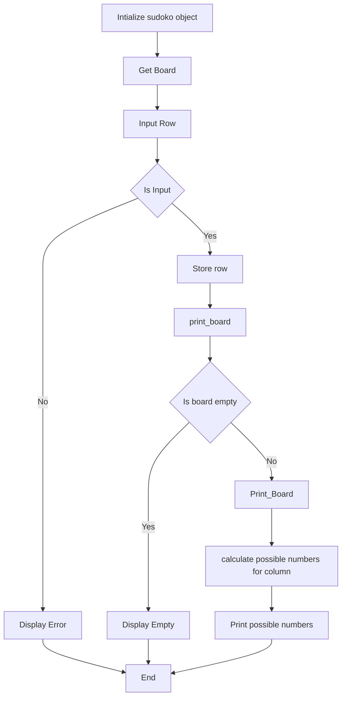

```mermaid
flowchart TB
    A[Intialize sudoko object] --> B[Get Board] 
    B--> b[Input Row]
    b --> C{Is Input}
    C -- Yes --> D[Store row]
    C -- No --> E[Display Error]
    E --> End
    D --> print_board
    print_board --> F{Is board empty}
    F-- Yes --> G[Display Empty]
    F -- No --> I[Print_Board]
    G --> End
    I --> J[calculate possible numbers for column]
    J --> k[Print possible numbers]
    k --> End
```
