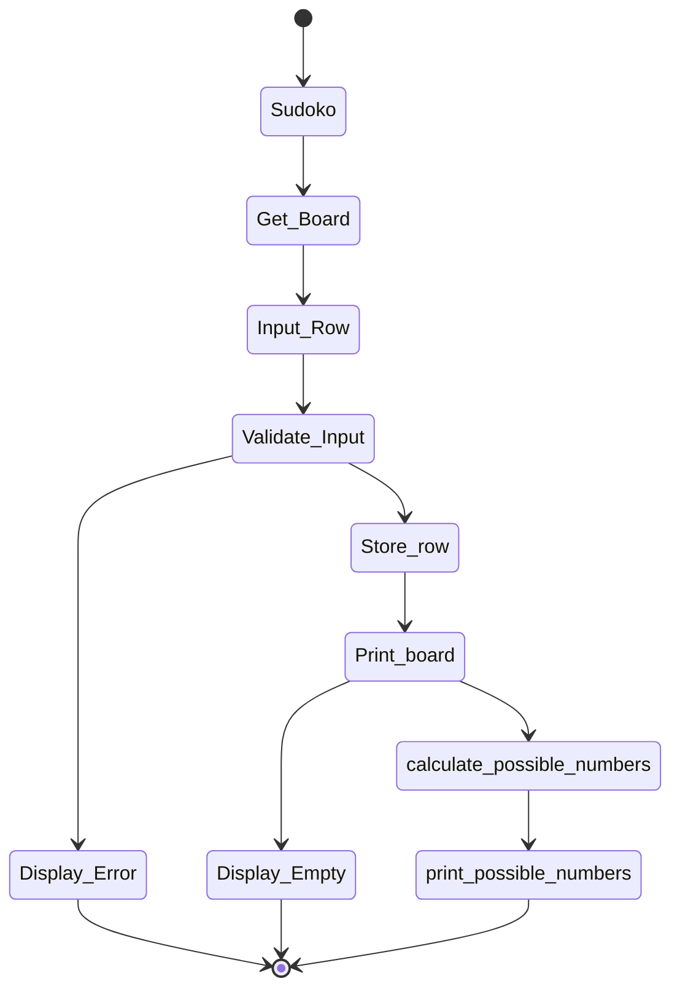

```mermaid
stateDiagram
    [*] --> Sudoko
    Sudoko --> Get_Board
    Get_Board --> Input_Row
    Input_Row --> Validate_Input
    Validate_Input --> Store_row
    Validate_Input --> Display_Error
    Display_Error -->[*]
    Store_row --> Print_board
    Print_board --> Display_Empty
    Display_Empty --> [*]
    Print_board --> calculate_possible_numbers
    calculate_possible_numbers --> print_possible_numbers
    print_possible_numbers --> [*]
```